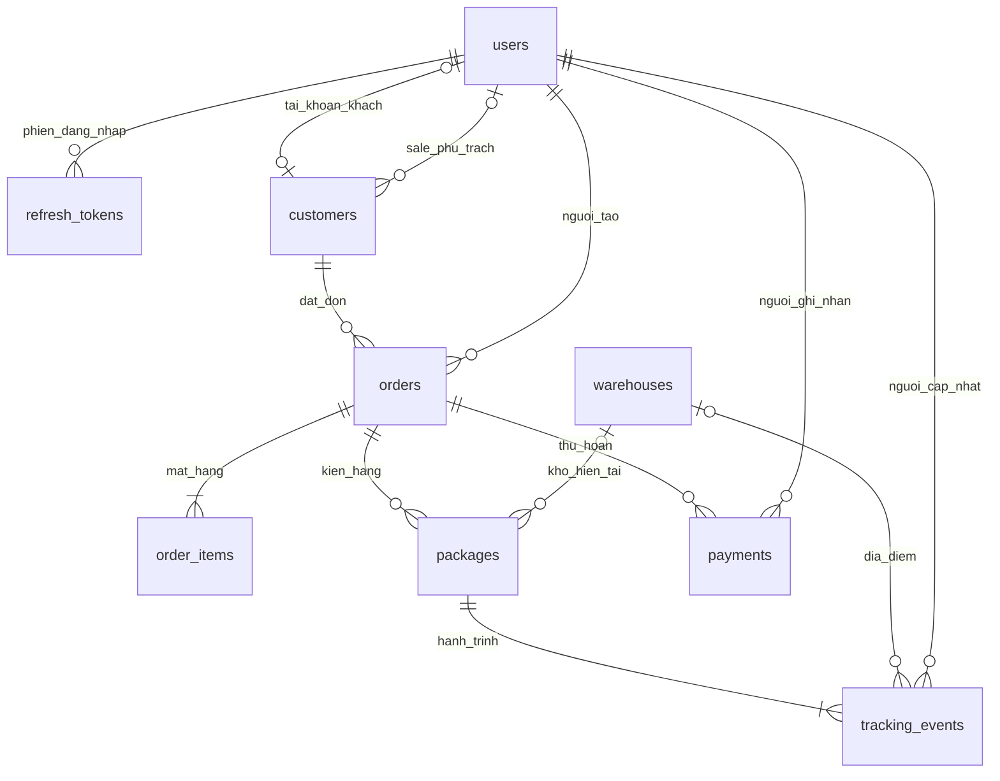

# Database Logistics Core — 9 bảng

**Chỉ triển khai database. Code/API vẫn là phiên bản cũ để bạn tự thực hành sau.** SQL tại `sql/logistics_core/01_schema.sql`.

Database thực tế: `cms_logistics_core`, MySQL. Khóa chính mọi bảng là `id` tự tăng. Các trường có thể NULL được đánh dấu trong cột ràng buộc; `id`, kiểu dữ liệu và ràng buộc dưới đây lấy từ SQL nguồn.

Quan hệ tài khoản khách là tùy chọn. Người tạo/cập nhật phải là tài khoản hợp lệ. Khi bạn thực hành code, nên tạo đơn kèm ít nhất một mặt hàng và tạo kiện kèm sự kiện CREATED; khóa ngoại SQL chỉ kiểm tra các bản ghi liên kết tồn tại.

## `users`

| Trường | Kiểu | Ràng buộc SQL |
|---|---|---|
| `id` | `BIGINT` | `AUTO_INCREMENT PRIMARY KEY` |
| `username` | `VARCHAR(50)` | `NOT NULL UNIQUE` |
| `email` | `VARCHAR(255)` | `UNIQUE; có thể NULL` |
| `full_name` | `VARCHAR(150)` | `NOT NULL` |
| `phone` | `VARCHAR(20)` | `Có thể NULL` |
| `password_hash` | `VARCHAR(255)` | `NOT NULL` |
| `role` | `VARCHAR(20)` | `NOT NULL CHECK (role IN ('ADMIN','SALE','WAREHOUSE','ACCOUNTANT','CUSTOMER'))` |
| `status` | `VARCHAR(20)` | `NOT NULL DEFAULT 'ACTIVE' CHECK (status IN ('ACTIVE','INACTIVE','LOCKED'))` |
| `last_login_at` | `DATETIME(6)` | `Có thể NULL` |
| `created_at` | `DATETIME(6)` | `NOT NULL DEFAULT CURRENT_TIMESTAMP(6)` |
| `updated_at` | `DATETIME(6)` | `NOT NULL DEFAULT CURRENT_TIMESTAMP(6)` |

## `refresh_tokens`

| Trường | Kiểu | Ràng buộc SQL |
|---|---|---|
| `id` | `BIGINT` | `AUTO_INCREMENT PRIMARY KEY` |
| `user_id` | `BIGINT` | `NOT NULL` |
| `jti` | `VARCHAR(64)` | `NOT NULL UNIQUE` |
| `expires_at` | `DATETIME(6)` | `NOT NULL` |
| `revoked_at` | `DATETIME(6)` | `Có thể NULL` |
| `created_at` | `DATETIME(6)` | `NOT NULL DEFAULT CURRENT_TIMESTAMP(6)` |

Ràng buộc bổ sung:

- `FOREIGN KEY (user_id) REFERENCES users(id) ON DELETE CASCADE`

## `customers`

| Trường | Kiểu | Ràng buộc SQL |
|---|---|---|
| `id` | `BIGINT` | `AUTO_INCREMENT PRIMARY KEY` |
| `user_id` | `BIGINT` | `UNIQUE; có thể NULL` |
| `name` | `VARCHAR(150)` | `NOT NULL` |
| `phone` | `VARCHAR(20)` | `NOT NULL` |
| `email` | `VARCHAR(255)` | `Có thể NULL` |
| `address` | `VARCHAR(500)` | `NOT NULL` |
| `assigned_staff_id` | `BIGINT` | `Có thể NULL` |
| `is_active` | `BOOLEAN` | `NOT NULL DEFAULT TRUE` |
| `created_at` | `DATETIME(6)` | `NOT NULL DEFAULT CURRENT_TIMESTAMP(6)` |
| `updated_at` | `DATETIME(6)` | `NOT NULL DEFAULT CURRENT_TIMESTAMP(6)` |

Ràng buộc bổ sung:

- `FOREIGN KEY (user_id) REFERENCES users(id)`
- `FOREIGN KEY (assigned_staff_id) REFERENCES users(id)`

## `warehouses`

| Trường | Kiểu | Ràng buộc SQL |
|---|---|---|
| `id` | `BIGINT` | `AUTO_INCREMENT PRIMARY KEY` |
| `code` | `VARCHAR(30)` | `NOT NULL UNIQUE` |
| `name` | `VARCHAR(150)` | `NOT NULL` |
| `address` | `VARCHAR(500)` | `NOT NULL` |
| `country_code` | `VARCHAR(2)` | `NOT NULL CHECK (country_code IN ('CN','VN'))` |
| `is_active` | `BOOLEAN` | `NOT NULL DEFAULT TRUE` |

## `orders`

| Trường | Kiểu | Ràng buộc SQL |
|---|---|---|
| `id` | `BIGINT` | `AUTO_INCREMENT PRIMARY KEY` |
| `order_code` | `VARCHAR(40)` | `NOT NULL UNIQUE` |
| `customer_id` | `BIGINT` | `NOT NULL` |
| `created_by` | `BIGINT` | `NOT NULL` |
| `receiver_name` | `VARCHAR(150)` | `NOT NULL` |
| `receiver_phone` | `VARCHAR(20)` | `NOT NULL` |
| `receiver_address` | `VARCHAR(500)` | `NOT NULL` |
| `shipping_fee` | `DECIMAL(18,2)` | `NOT NULL DEFAULT 0 CHECK (shipping_fee >= 0)` |
| `status` | `VARCHAR(20)` | `NOT NULL DEFAULT 'PENDING' CHECK (status IN ('PENDING','CONFIRMED','SHIPPING','DELIVERED','CANCELLED'))` |
| `note` | `VARCHAR(2000)` | `Có thể NULL` |
| `created_at` | `DATETIME(6)` | `NOT NULL DEFAULT CURRENT_TIMESTAMP(6)` |
| `updated_at` | `DATETIME(6)` | `NOT NULL DEFAULT CURRENT_TIMESTAMP(6)` |

Ràng buộc bổ sung:

- `FOREIGN KEY (customer_id) REFERENCES customers(id)`
- `FOREIGN KEY (created_by) REFERENCES users(id)`
- `INDEX ix_orders_status (status)`

## `order_items`

| Trường | Kiểu | Ràng buộc SQL |
|---|---|---|
| `id` | `BIGINT` | `AUTO_INCREMENT PRIMARY KEY` |
| `order_id` | `BIGINT` | `NOT NULL` |
| `product_name` | `VARCHAR(255)` | `NOT NULL` |
| `quantity` | `INT` | `NOT NULL CHECK (quantity > 0)` |
| `note` | `VARCHAR(2000)` | `Có thể NULL` |

Ràng buộc bổ sung:

- `FOREIGN KEY (order_id) REFERENCES orders(id)`

## `packages`

| Trường | Kiểu | Ràng buộc SQL |
|---|---|---|
| `id` | `BIGINT` | `AUTO_INCREMENT PRIMARY KEY` |
| `order_id` | `BIGINT` | `NOT NULL` |
| `tracking_code` | `VARCHAR(50)` | `NOT NULL UNIQUE` |
| `warehouse_id` | `BIGINT` | `Có thể NULL` |
| `weight_kg` | `DECIMAL(12,3)` | `NOT NULL CHECK (weight_kg > 0)` |
| `length_cm` | `DECIMAL(10,2)` | `NOT NULL CHECK (length_cm > 0)` |
| `width_cm` | `DECIMAL(10,2)` | `NOT NULL CHECK (width_cm > 0)` |
| `height_cm` | `DECIMAL(10,2)` | `NOT NULL CHECK (height_cm > 0)` |
| `status` | `VARCHAR(20)` | `NOT NULL DEFAULT 'CREATED' CHECK (status IN ('CREATED','IN_WAREHOUSE','IN_TRANSIT','DELIVERED','CANCELLED'))` |
| `created_at` | `DATETIME(6)` | `NOT NULL DEFAULT CURRENT_TIMESTAMP(6)` |
| `updated_at` | `DATETIME(6)` | `NOT NULL DEFAULT CURRENT_TIMESTAMP(6)` |

Ràng buộc bổ sung:

- `FOREIGN KEY (order_id) REFERENCES orders(id)`
- `FOREIGN KEY (warehouse_id) REFERENCES warehouses(id)`
- `CHECK ((status = 'IN_WAREHOUSE' AND warehouse_id IS NOT NULL) OR (status <> 'IN_WAREHOUSE' AND warehouse_id IS NULL))`

## `tracking_events`

| Trường | Kiểu | Ràng buộc SQL |
|---|---|---|
| `id` | `BIGINT` | `AUTO_INCREMENT PRIMARY KEY` |
| `package_id` | `BIGINT` | `NOT NULL` |
| `warehouse_id` | `BIGINT` | `Có thể NULL` |
| `status` | `VARCHAR(20)` | `NOT NULL CHECK (status IN ('CREATED','IN_WAREHOUSE','IN_TRANSIT','DELIVERED','CANCELLED'))` |
| `note` | `VARCHAR(2000)` | `Có thể NULL` |
| `created_by` | `BIGINT` | `NOT NULL` |
| `created_at` | `DATETIME(6)` | `NOT NULL DEFAULT CURRENT_TIMESTAMP(6)` |

Ràng buộc bổ sung:

- `FOREIGN KEY (package_id) REFERENCES packages(id)`
- `FOREIGN KEY (warehouse_id) REFERENCES warehouses(id)`
- `FOREIGN KEY (created_by) REFERENCES users(id)`
- `INDEX ix_tracking_events_time (package_id, created_at, id)`

## `payments`

| Trường | Kiểu | Ràng buộc SQL |
|---|---|---|
| `id` | `BIGINT` | `AUTO_INCREMENT PRIMARY KEY` |
| `order_id` | `BIGINT` | `NOT NULL` |
| `amount` | `DECIMAL(18,2)` | `NOT NULL CHECK (amount > 0)` |
| `type` | `VARCHAR(10)` | `NOT NULL CHECK (type IN ('PAYMENT','REFUND'))` |
| `method` | `VARCHAR(20)` | `NOT NULL CHECK (method IN ('CASH','BANK_TRANSFER'))` |
| `reference_code` | `VARCHAR(80)` | `NOT NULL UNIQUE` |
| `created_by` | `BIGINT` | `NOT NULL` |
| `created_at` | `DATETIME(6)` | `NOT NULL DEFAULT CURRENT_TIMESTAMP(6)` |

Ràng buộc bổ sung:

- `FOREIGN KEY (order_id) REFERENCES orders(id)`
- `FOREIGN KEY (created_by) REFERENCES users(id)`

## Giải thích để trình bày

1. `users` phục vụ đăng nhập; `customers` lưu thông tin khách đặt vận chuyển. Khách có thể chưa có tài khoản nên hai bảng tách riêng.
2. `orders` là đơn tổng, giữ người nhận và phí đã chốt. `order_items` lưu mặt hàng khai báo, không cần danh mục sản phẩm riêng.
3. Một đơn có thể đóng nhiều `packages`. Mã vận đơn là `tracking_code`; mỗi kiện có cân nặng, kích thước và kho hiện tại.
4. `tracking_events` ghi từng bước vận chuyển, tránh mất lịch sử khi trạng thái kiện thay đổi.
5. `payments` ghi thu/hoàn tiền. Công nợ được tính từ nhật ký và phí đơn; không giữ cột số dư dễ lệch.
6. `refresh_tokens` cần cho thu hồi phiên đăng nhập và đổi token. Vai trò lưu trực tiếp trong `users.role`, không thêm bảng roles.

Các bảng nghiệp vụ chưa có dữ liệu giao dịch khi tạo database; chỉ seed 5 tài khoản dev và 2 kho mẫu. Không dùng bảng này để kết luận các request HTTP đã được test.
